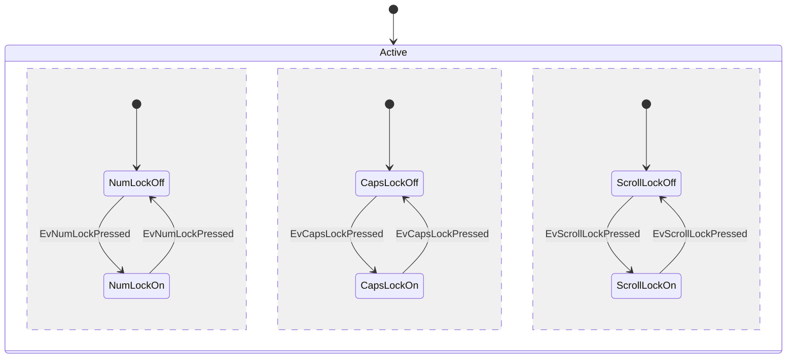
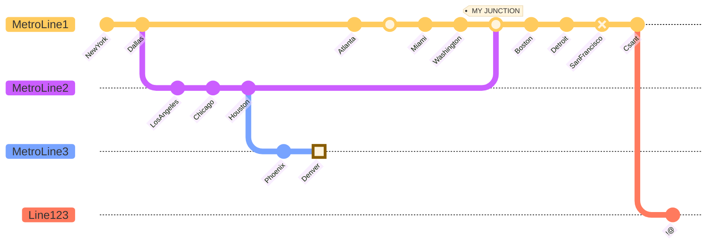

# Тестовая версия страницы

> tg: [@kartaew](https://t.me/kartaew) 

По мере надобности здесь будут добавляться всякие забавные вещи

Например какой-то код
  
``` python
from functools import lru_cache


def moves(h):  
    a = h  
    return (a + 1), (a + 4), a*5  
  
@lru_cache(None)  
def game(m):  
    if m >= 68:  
        return 'WIN'  
  if any(game(s) == 'WIN' for s in moves(m)):  
        return 'P1'  
  if all(game(s) == 'P1' for s in moves(m)):  
        return 'B1'  
  if any(game(s) == 'B1' for s in moves(m)):  
        return 'P2'  
  if all(game(s) == 'P1' or game(s) == 'P2' for s in moves(m)):  
        return 'B1/2'  
  
for k in range(1, 68):  
    print(k, game(k))
```

# Еще сюда можно писать код *LaTeX*

$$f(m)=\frac{80m}{(1+m)^{\frac{a+1}{2}}} \rightarrow maximize$$

$$f'(m)=\frac{80(1+m)^{\frac{a+1}{2}}-80m(\frac{a+1}{2})(1+m)^{\frac{a-1}{2}}}{(1+m)^{a+1}}$$

Знаменатель всегда положительный, не имеет смысла рассматривать.

Преобразуем числитель и приравняем к нулю:

$$[40(1+m)^{\frac{a-1}{2}}]\cdot [(2(1+m)-m(a+1))]=0$$

# Можно создавать списки

 - lorem ipsum
 - ipsum lorem
 - [x] to do list 
 - [ ] not to do list :) 

# Графы тоже работают





